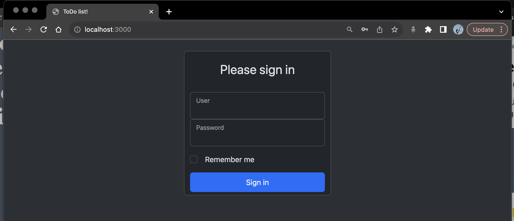
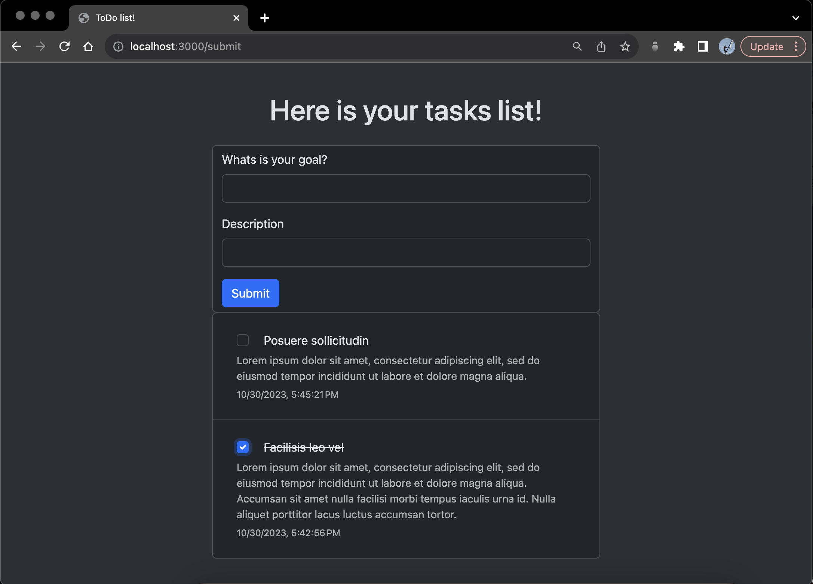

# ToDo list project

MyToDoList is a simple web-based ToDo list application designed for practicing HTML, CSS, EJS, and JavaScript. With this application, a user can easily manage their tasks. It provides a straightforward way to add new tasks, mark tasks as completed, and view tasks that have been finished.

## Run Locally

Clone the project

```bash
  git clone https://github.com/omanpios/todo
```

Go to the project directory

```bash
  cd todo
```

Install dependencies

```bash
  npm install
```

Start the server

```bash
  npm run start
```


## Demo

Login:


ToDo List:


## Authors

- [@omanpios](https://github.com/omanpios)

